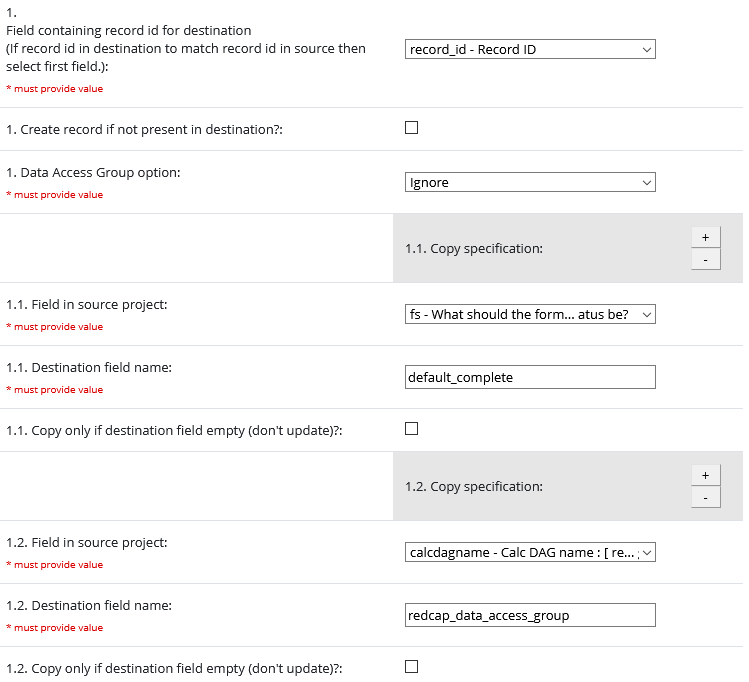

# Copy Data on Save

## Description

This module enables data to be copied from one place to another when you save a form. You can set up multiple copy processes to different projects or even to other fields in the same project.

Copying the value of one field to multiple fields in the destination *is* supported. (Copying multiple fields to a single field is also supported but only the last value will be retained!)

Enable and configure the module in the source project. No action is required in the destination project.

## Repeating Data

Behaviour with repeating data is dependent on whether the field is repeating in the source, or in the destination, or both, as follows:

| Source        | Destination   | Behaviour              |
| ------------- | ------------- | ---------------------- |
| Not repeating | Not repeating | To non-repeating field |
| Repeating     | Not repeating | To non-repeating field |
| Not repeating | Repeating     | New instance \*        |
| Repeating     | Repeating     | Same instance          |

\* Note that this will create a new instance *every time the rule is triggered*. Select the "only if empty" option to create a new instance only when the value copied is different to the value in the current highest-numbered instance. This mode is like an audit trail - it gives a history of values for a field. 

## Limitations

* Data may be copied *from* fields only in the same event as the triggering form.
* Data may be copied *to* fields in a single event. To copy to multiple events set up a trigger/rule for each event.
* Copying data occurs when a data entry form or survey page is saved. Copying is not triggered for data imports.

## Configuration

**Enabled?**
* Check to enable the copy process. Uncheck to disable.

**Trigger form(s)**
* One or more instruments for which the current copy process will be triggered.

**Trigger condition**
* *Optional*: a REDCap logic expression that must evaluate to *true* for the current ercord in order for the copty process to be executed. Leave empty to always copy on saving the trigger form(s).
	
**Destination project**
* The project to copy data *to*. Can be within the current project e.g. copying data to other events or fields.
	
**Destination event name**
* *Optional*: the unique event name of the event to copy data to in the destination. Leave empty if the destination is not longitudinal or to copy to the first event.

**Field for record id**
* Select the field in the source project that will be utilised as the record id for the copied data. If the records are to be named the same in source and destination then select the first field.

**Destination project's field to match with**
* Variable containing the value to match with the value in the destination variable indicated in the feld here below (If record id in destination to match record id in source then select first field).
	
**Create destination records**
* Set whether the process should create a record in the destination project if it does not already exist.

**Data Access Group option**
* Select how the DAG of the copied record should be utilised.
    1. Ignore: do not set or update the DAG for the record in the destination project.
    2. Include DAG in copy: the unique DAG name for the source record's DAG will be included in the copy. Destination DAGs must have matching names for the copy to be successful.
    3. Map source DAGs to destination DAGs: specify the destination DAG to use for each source DAG. Multiple DAGs in the source project can be mapped to a single destination DAG.

**DAG Mapping**
* Utilised for DAG option "Map source to destination" only. Unfortunately due to a current limitation of the module framework branching logic does not work for sub-settings.
* Do not enter settings here if no DAGs to copy or if DAG names match.
* Source DAGs not listed will be ignored and there will be no DAG assigned in the destination.
* Mapping multiple source DAGs to a single destination DAG is perfectly legitimate...
* Mapping a source DAG to multiple destination DAGs is not. The last one wins.

**Copy fields**
* Pairs of fields mapping the source to the destination.
* Select the "only if empty" checkbox if you want the copy to occur only for an initial value in the source field (i.e. copy the value only when the destination field is empty).

## Example

This example illustrates a few things that the module facilitates:
* Copying data between fields in the same project
* Setting the Form Status automatically (in this case using a radio field, but using a calc field is an alternative).
* Setting the record's DAG automatically by using a text field with @CALCTEXT() to generate a valid unique DAG name.
`@CALCTEXT(if([record-name] - rounddown(([record-name]/2),0)*2=0,'even','odd'))`

 
